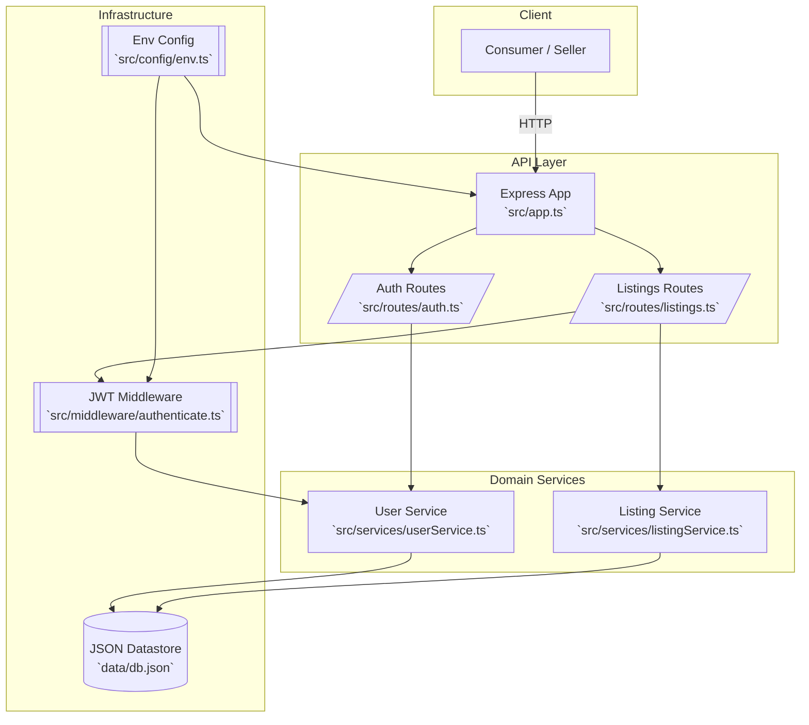

# X-Value Backend

## Overview
Node.js backend service for X-Value car listing platform, providing RESTful APIs for car listings, user management, and bookmarks with a focus on performance and reliability.

## 🚀 Quick Start

```bash
# Install dependencies
npm install

# Start development server
npm run dev

# Run tests
npm test
```

## 🛠 Tech Stack

- Node.js + Express
- TypeScript with `ts-node-dev` for DX
- JSON-based datastore (simple persistence via `data/db.json`)
- JWT authentication with hashed passwords (`bcryptjs`)
- Input validation powered by `zod`

## Architecture Diagram



## Getting Started

## Firstly: Create A Folder Called backend And clone the project

### 1. Install dependencies

```powershell
npm install
```

### 2. Configure environment

Duplicate `.env.example` to `.env` and override values as needed.

| Variable | Purpose | Default |
| --- | --- | --- |
| `PORT` | HTTP port | `3000` |
| `JWT_SECRET` | Secret used for signing JWTs | `changeme-in-production` |
| `DATA_FILE_PATH` | Absolute path to the JSON datastore | `<repo>/data/db.json` |

### 3. Run locally

Start the development server with automatic reloads:

```powershell
npm run dev
```

To build and run the compiled output:

```powershell
npm run build
npm start
```

### 4. Verify TypeScript types

```bash
npm run check
```

## 📡 API Endpoints

### Authentication
```
POST /auth/register - Register new user
POST /auth/login    - User login
```

### Listings
```
GET    /listings     - List all cars with filtering & sorting
POST   /listings     - Create listing
GET    /listings/:id - Get specific listing
PUT    /listings/:id - Update listing
DELETE /listings/:id - Delete listing
GET    /listings/my  - Get user's listings
```

### Bookmarks
```
GET    /bookmarks          - Get user bookmarks
POST   /bookmarks/:listingId - Add bookmark
DELETE /bookmarks/:listingId - Remove bookmark
```

### Query Parameters
- **Filtering:**
  - `minPrice`, `maxPrice`: Price range
  - `minYear`, `maxYear`: Year range
  - `minMileage`, `maxMileage`: Mileage range
  - `fuelType`: Fuel type filter
  - `transmission`: Transmission type
  - `location`: Location search
  - `make`, `model`: Car details

- **Sorting:**
  - `sortBy`: price, year, mileage, createdAt
  - `sortOrder`: asc, desc

### Request Bodies

```typescript
// Authentication
interface RegisterRequest {
  email: string;
  password: string;
}

interface LoginRequest {
  email: string;
  password: string;
}

// Listings
interface CreateListingRequest {
  make: string;
  model: string;
  year: number;
  price: number;
  mileage: number;
  fuelType: 'petrol' | 'diesel' | 'electric' | 'hybrid';
  transmission: 'manual' | 'automatic';
  location: string;
  images?: string[];
  description?: string;
}

// UpdateListingRequest can be partial of CreateListingRequest
```

## 💾 Data Models

```typescript
interface User {
  id: string;
  email: string;
  password: string; // Hashed
  createdAt: Date;
}

interface Listing {
  id: string;
  userId: string;
  make: string;
  model: string;
  year: number;
  price: number;
  mileage: number;
  fuelType: string;
  transmission: string;
  location: string;
  createdAt: Date;
  images?: string[];
  description?: string;
}

interface Bookmark {
  id: string;
  userId: string;
  listingId: string;
  createdAt: Date;
}
```

## 🔒 Security

### Authentication
- JWT token validation
- Password hashing with bcrypt
- Protected routes
- Input sanitization

### Data Validation
- Request body validation
- Query parameter validation
- Type checking
- Error handling

## 📊 Data Persistence

The MVP persists data in `data/db.json`. This keeps setup simple for local collaboration. For production use, migrating to a real database (e.g., PostgreSQL, MongoDB) is recommended.

## Project Structure

```
src/
  app.ts            # Express app wiring
  server.ts         # Startup entry point
  config/           # Environment configuration
  data/             # Lightweight JSON datastore
  middleware/       # Shared middleware (JWT auth)
  routes/           # Route modules
  services/         # Business/domain logic
  types/            # Shared TypeScript types
  utils/            # Helpers (validation, passwords)
```

## Next Steps

- Swap the JSON datastore for a database (MongoDB, PostgreSQL, etc.).
- Add automated tests (integration + unit) and CI.
- Extend listings to include richer metadata and filtering.
- Add admin tooling to toggle verified sellers.
